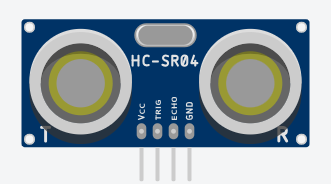
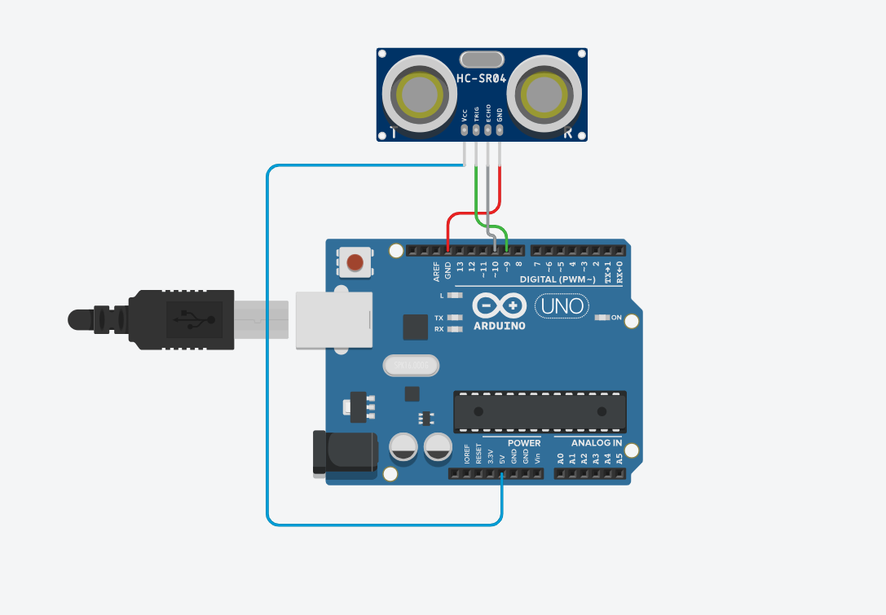
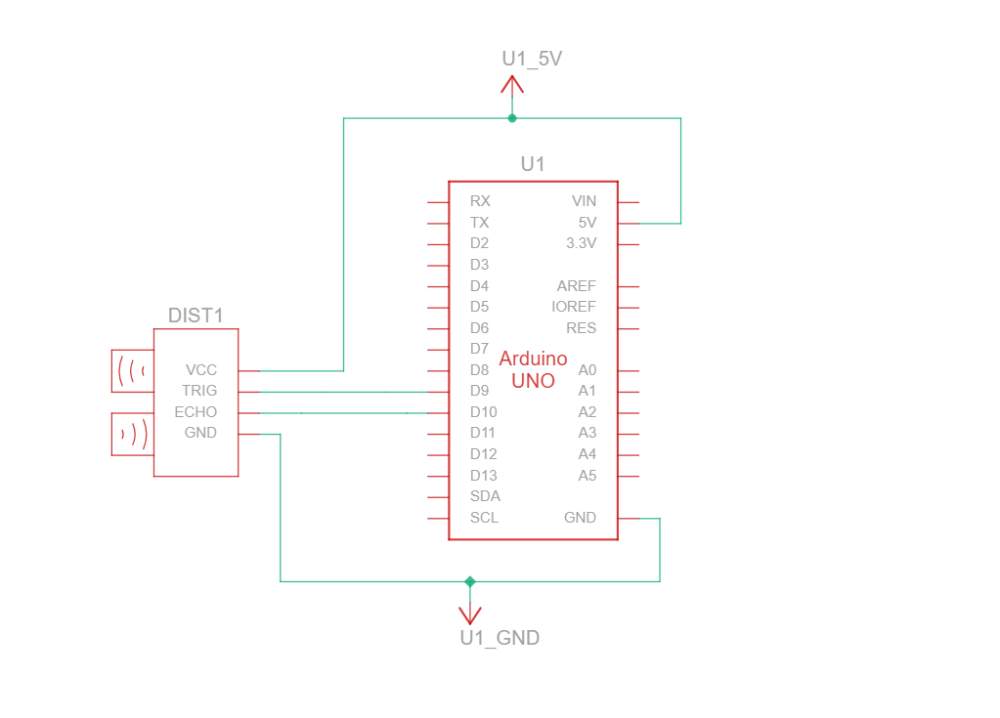

# Fisica I - Cinemática

### Componentes:
<body>
    <div style="text-align: center;">
        <figure>
            
            <figcaption>1. Sensor de Presença</figcaption>
        </figure>
        <figure>
            
            <figcaption>2. Arduino UNO</figcaption>
        </figure>
    </div>
</body>

### HC-SR04 Sensor:
O sensor ultrassônico possui 4 pinos (VCC, GND, TRIG, ECHO).
* **VCC:** Fornece energia ao sensor;
* **GND:** Fornece uma referÊncia de terra;
* **TRIG:** Envia o pulso ultrassônico;
* **ECHO:** Recebe o eco do pulso ultrassônico;
1. Conecte o pino VCC do sensor ao pino 5V do Arduino

## Medição da velocidade
Experimento de cinemática que consiste em medir a velocidade de um objeto em movimento utilizando um sensor de presença.

## Materias necessários
1. 4 Fios jumpers (macho-fêmea);
2. 1 Sensor ultrassônico;
3. Uma placa arduino UNO;
4. Software Arduino IDE / VSCode (PlatformIO)


### Passo a passo:
1.  Conecte o pino VCC do sensor ao pino 5V do Arduino;
2.  Conecte o pino GND do sensor ao pino GND do Arduino;
3.  Conecte o pino TRIG do sensor ao pino digital 9 do Arduino;
4. Conecte o pino ECHO do sensor ao pino digital 10 do Arduino;
5. Conecte o arduino à uma porta USB do seu notebook;
6. Programe o código-fonte na placa arduino;

### Circuito:
<body>
    <div style="text-align: center;">
        <figure>
            
            <figcaption>3. Circuito</figcaption>
        </figure>
        <figure>
            
            <figcaption>4. Vista esquemática</figcaption>
        </figure>
    </div>
</body>

### Código:
```c++
#define TRIG_PIN 9 /*Define o pino digital que envia o pulso*/
#define ECHO_PIN 10 /*Define o pino digital que recebe o eco do pulso*/

long duration; /*Armazena a duração do pulso recebido*/
float distance; /*Distância calculada pelo sensor*/
float time1, time2, velocity; /*Variaveis para o calculado, define time1(inicio) - time2(final) - velocidade*/

void setup() {
  Serial.begin(9600); /* Inicializa a comunicação serial com baud rate de 9600 */
  pinMode(TRIG_PIN, OUTPUT); /* Define o TRIG como saída */
  pinMode(ECHO_PIN, INPUT); /* Define o ECHO como entrada */
}

void loop() {
  digitalWrite(TRIG_PIN, LOW); /*Pino TRIG baixo por 2ms*/
  delayMicroseconds(2);
  digitalWrite(TRIG_PIN, HIGH);/* Define o pino TRIG como alto por 10 microssegundos */
  delayMicroseconds(10);
  digitalWrite(TRIG_PIN, LOW); /* Define o pino TRIG como baixo */

  duration = pulseIn(ECHO_PIN, HIGH); /* Mede o tempo que o pulso leva para retornar */
  distance = (duration * 0.034) / 2; /* Calcula a distância com base no tempo */

  if (distance < 10) {
    if (time1 == 0) {
      time1 = millis(); /* Registra o tempo inicial */
    } else {
      time2 = millis();
      float timeInterval = (time2 - time1) / 1000.0; /* Calcula o intervalo de tempo em segundos */
      float distanceTravelled = 0.1; /* Distância percorrida (exemplo) */
      velocity = distanceTravelled / timeInterval; /* Calcula a velocidade */
      Serial.print("Velocidade do carrinho: ");
      Serial.print(velocity); /*Resultado no monitor serial*/
      Serial.println(" m/s");
      time1 = 0; /*Reinicia os tempos*/
      time2 = 0;
    }
  }
}
```
### Ferramentas
