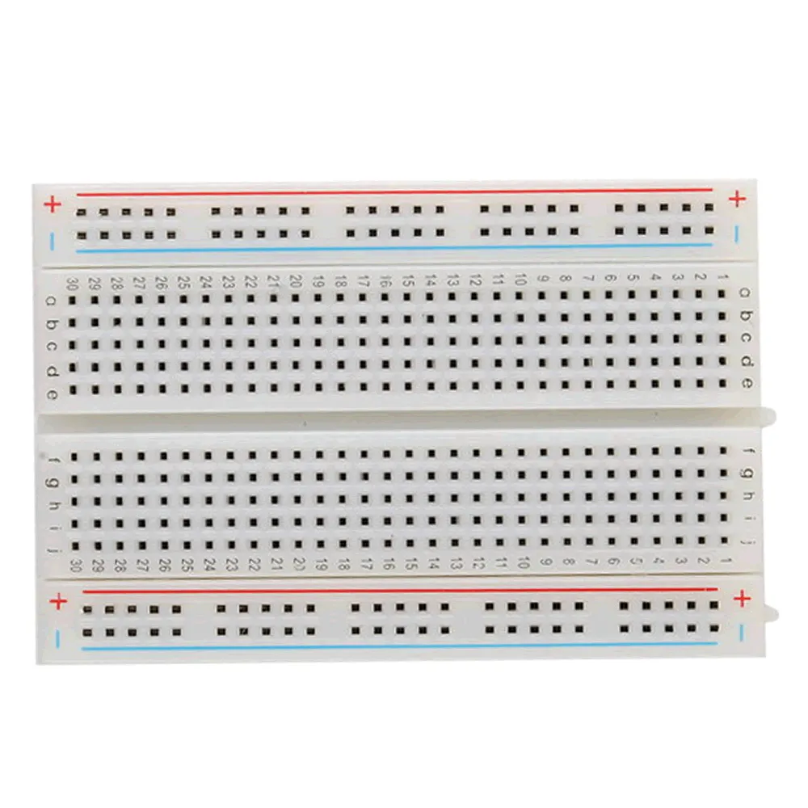
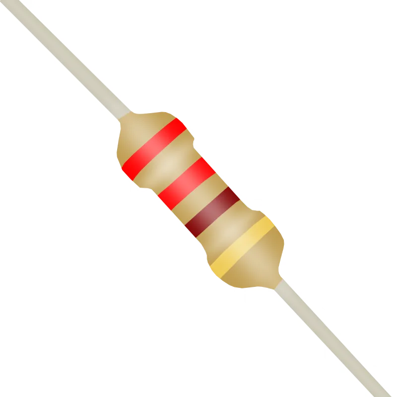

# Física I - Cinemática

## Componentes:

<body>
    <div style="text-align: center;">
        <figure>
            
            <figcaption>1. Arduino UNO</figcaption>
        </figure>
        <figure>
            
            <figcaption>2. Protoboard</figcaption>
        </figure>
        <figure>
            
            <figcaption>3. Resistor 220 ohms</figcaption>
        </figure>
    </div>
</body>

## Texto em Código Morse
O experimento consiste em definir um texto no programa principal e, a partir da dinâmica dos LEDs (DOT e DASH), o programa irá codificá-lo em Código Morse.

## Materiais necessários
1. 4 Fios jumpers;
2. Uma placa Arduino UNO;
3. 2 resistores de 220 ohms;
4. Software Arduino IDE / VSCode (PlatformIO).

## Passo a passo:
1. Conecte os dois LEDs à protoboard;
2. Conecte os dois resistores em cada catodo dos LEDs e conecte a perna do resistor ao negativo da protoboard;
3. Conecte o primeiro LED (DOT) ao positivo da protoboard e coloque-o na porta digital 12;
4. Conecte o segundo LED (DASH) à porta digital 13 do Arduino UNO.

## Circuito:

<body>
    <div style="text-align: center;">
        <figure>
            
            <figcaption>4. Circuito</figcaption>
        </figure>
        <figure>
            
            <figcaption>5. Vista esquemática</figcaption>
        </figure>
    </div>
</body>

## Código:
```cpp
#define LedPinDot 12
#define LedPinDash 13

void setup() {
  pinMode(LedPinDot, OUTPUT);
  pinMode(LedPinDash, OUTPUT);
  Serial.begin(9600); // Inicia a comunicação serial com baud rate de 9600
}

void loop() {
  morseCode("ANDERSON");
  while (true) {} // Parar após a mensagem ser enviada
}

void morseCode(String message) {
  for (int i = 0; i < message.length(); i++) {
    char c = toupper(message[i]);
    Serial.print("Letra: ");
    Serial.println(c);
    if (c == ' ') {
      delay(7000); // Espaço entre palavras (7 unidades)
    } else {
      morseChar(c);
      delay(3000); // Espaço entre letras (3 unidades)
    }
  }
}

void morseChar(char c) {
  switch (c) {
    case 'A': Serial.println(".-"); dot(); dash(); break;    // .-
    case 'N': Serial.println("-."); dash(); dot(); break;    // -.
    case 'D': Serial.println("-.."); dash(); dot(); dot(); break; // -..
    case 'E': Serial.println("."); dot(); break;            // .
    case 'R': Serial.println(".-."); dot(); dash(); dot(); break; // .-.
    case 'S': Serial.println("..."); dot(); dot(); dot(); break;  // ...
    case 'O': Serial.println("---"); dash(); dash(); dash(); break; // ---
    default: break;
  }
  delay(3000); // Espaço entre caracteres na mesma letra (3 unidades)
}

void dot() {
  digitalWrite(LedPinDot, HIGH);
  delay(1000); // 1 unidade de tempo
  digitalWrite(LedPinDot, LOW);
  delay(1000); // Espaço entre sinais
}

void dash() {
  digitalWrite(LedPinDash, HIGH);
  delay(3000); // 3 unidades de tempo
  digitalWrite(LedPinDash, LOW);
  delay(1000); // Espaço entre sinais
}
